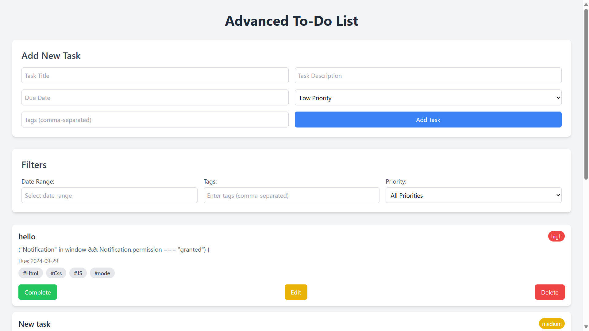

Name: VIVEK PRADHAN.

Company: CODETECH IT SOLUTIONS

ID: CT04DS7463

Domain: WEB DEVELOPMENT

Duration: August to September 2024

## Overview of the Project

### Project: To-Do List Web Application (Task - 1)

### Objective

The objective of this project is to develop an advanced, user-friendly to-do list application that allows users to efficiently manage and organize their daily tasks. The app includes features for adding, editing, deleting, and filtering tasks, providing users with an intuitive way to track their progress and ensure productivity.

### Key Activities

- Task Management: Users can add, edit, delete, and mark tasks as completed or incomplete.
- Task Filters: Tasks can be filtered by priority, tags, and due date range.
- Drag-and-Drop Reordering: Tasks can be reordered using a drag-and-drop interface for ease of management.
- Task Completion Rate Chart: A dynamic chart displays task completion rates, providing users with a visual representation of their progress.
- Local Storage: All tasks are stored in the browser's local storage, ensuring data persistence across sessions without the need for a backend.
- Editable Task Fields: Users can update task details such as title, description, due date, priority, and tags.
- Date Picker: The app uses a date picker for easy selection of due dates.

### Technologies Used

- HTML5 and CSS3: For structuring and styling the application.
- JavaScript: For dynamic task management, event handling, and interactivity.
- Tailwind CSS: A utility-first CSS framework for responsive design and styling.
- Flatpickr: A lightweight date picker library for selecting due dates.
- SortableJS: For implementing the drag-and-drop functionality.
- Chart.js: For creating a task completion rate chart.
- Local Storage: To store tasks and retain data across sessions.

### Key Insights

- User Experience Matters: Implementing an intuitive UI and drag-and-drop features made the application more engaging and user-friendly.
- Efficient Task Filtering: Adding filter functionality by date, tags, and priority enhances task organization and helps users focus on important tasks.
- Data Persistence with Local Storage: Storing tasks in local storage allowed the app to function offline and retain tasks across browser sessions, enhancing user convenience.
- Dynamic Feedback with Charts: Visualizing task completion with a chart provided users with clear feedback on their productivity, which can motivate them to complete more tasks.
